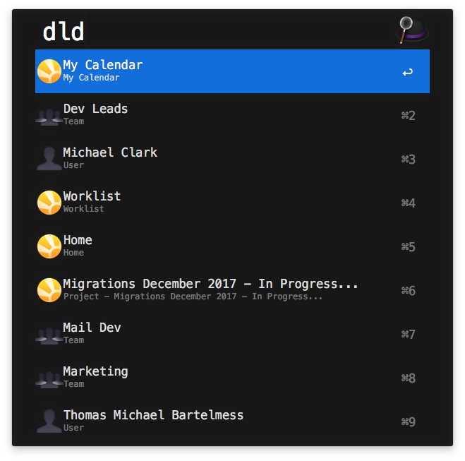
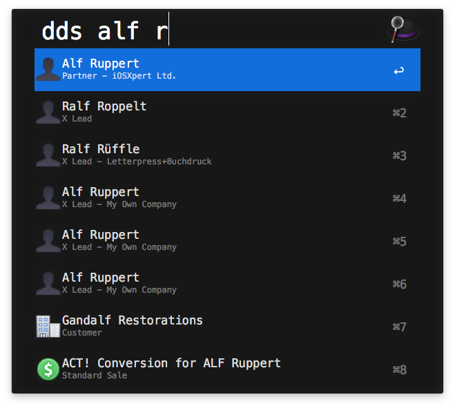
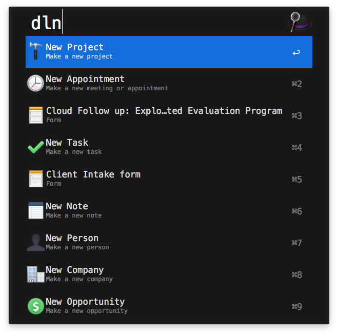
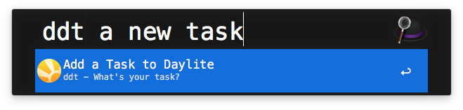

# alfred-daylite
Alfred shortcuts for Daylite

## Requirements
You will need Alfred 3 and Daylite 6 for Mac. It’s been tested with Daylite 6.4 however, I don’t why it wouldn’t work with any version of Daylite 6.

## Installation
- Download Daylite.alfredworkflow on your Mac.
- Double click on the workflow and it should be added to Alfred.

## Usage
There are 5 shortcuts.

### Go to a sourcelist or calendar
You can go to any smartlist, team calendar, or user calendar you have access to using the _dld_ shortcut.

```
dld <source list name>
```

For example:

```
dld my calendar
dld home
dld worklist
dld …
```




### Search for People, Companies, Open Opportunities and Projects.
You can search for a person/company/project/opportunity by typing in parts of their name.

```
dds <search term>
```

For example:

```
dds alf r
dds bill verkaik migration
```

Limitations: 

- We only grab the top 12 matches, sorted by modify date descending.
- We only look for new or in-progress projects.
- We only look for open opportunities.




### Create Card Shortcuts
When you want to create a contact, project, opportunity or form quickly, you can bring up the create card using the _dln_ shortcut.

```
dln <object type or form name>
```

For example:

```
dln appointment
dln client intake form
```



### Create a Task
You often want to create a task quickly. Of course, Daylite has the New Task hotkey which works great.

This mechanism is even faster as your hands don’t need to leave the keyboard at all.

You can create a task and put it in your worklist, in-progress, inbox or someday lists.


```
ddt <task title>
```



### Delegate a Task
Similar to task creation, you can delegate a new task to someone without leaving your keyboard at all.

Whomever you delegate too, will get a push notification about the delegated task.

```
ddd <task title>
```


## Note on API used
We’ve accomplished these shortcuts by using F-Script wrapped in AppleScript. In those F-Script snippets, we’ve used some private APIs. If this integration becomes popular, we can look at standardizing those APIs or providing some official covers.